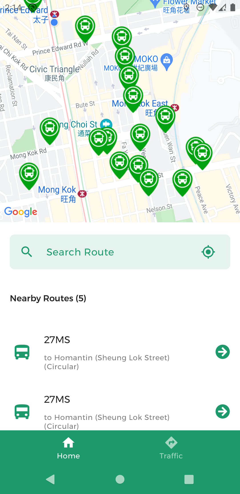
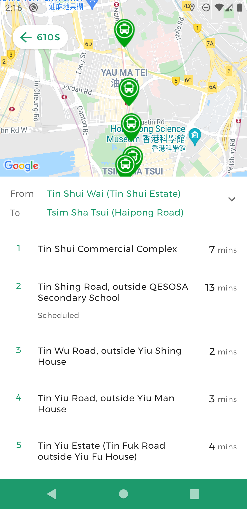
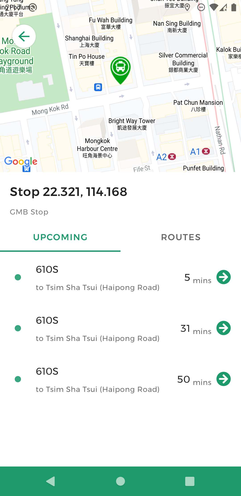
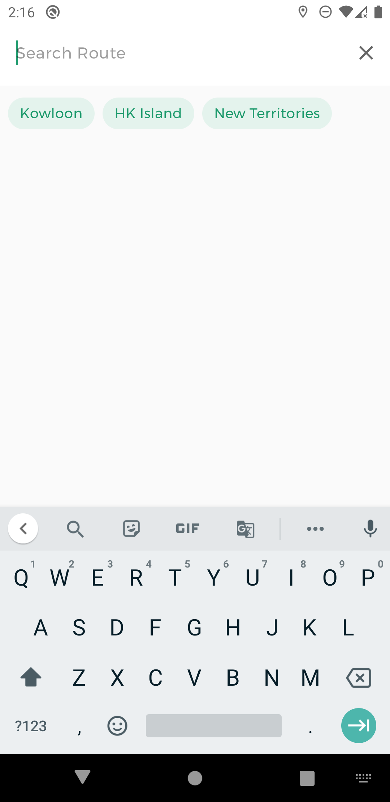

# GreenTransit

GreenTransit is a mobile application that offers details about green minibus (GMB) routes in HK.

## Description

Provides users the estimated green minibus (GMB) arrival time and the latest route and stop information to help with journey planning.

## API Used
- [Real-time arrival data of green minibuses (GMBs)](https://data.gov.hk/en-data/dataset/hk-td-sm_7-real-time-arrival-data-of-gmb)
- [Special Traffic News](https://data.gov.hk/en-data/dataset/hk-td-tis_1-special-traffic-news)

## Features

- Display nearby GMB routes
- Show information about a specific GMB route
- Show ETAs for a specific GMB stop
- Search for GMB routes within a region
- Receive latest traffic news

## Screenshots

    
    
    

    
    
    

